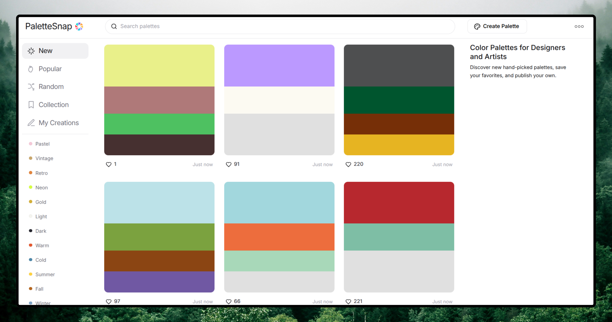

# <a href="https://palettesnap.vercel.app" target="_blank">PaletteSnap - A Digital Dictionary of Color Combinations</a>

**PaletteSnap** is a high-fidelity digital archive of Wada Sanzō's seminal 6-volume color study from the 1930s. Explore a curated collection of 162 traditional Japanese pigments, discover historical multi-color harmonies (Plates), and experience the intersection of early 20th-century color theory and modern web design.

Built for archival precision, monumental typography, and minimalist immersion — bringing a masterpiece of color history to the browser.

<p align="left">
<a href="https://github.com/byllzz/palettesnap/blob/main/LICENSE">

</a>


<a href="https://github.com/byllzz">

</a>
<a href="https://github.com/byllzz/palettesnap/releases">

</a>
<a href="https://github.com/byllzz/palettesnap/issues">

</a>
<a href="https://github.com/byllzz/palettesnap/pulls">

</a>
</p>
<br />

[](https://palettesnap.vercel.app)



⭐ **Star the repo if you appreciate the aesthetic — it really helps!**

---

## Table of Contents

- [Key Features](#key-features)
- [Feature Breakdown](#feature-breakdown)
- [Technical Architecture](#technical-architecture)
- [Folder Structure](#folder-structure)
- [Technologies Used](#technologies-used)
- [Installation & Setup](#installation--setup)
- [TypeScript Migration](#typescript-migration)
- [Contributing](#contributing)
- [Roadmap](#roadmap)
- [License](#license)
- [Acknowledgments](#acknowledgments)
- [Feedback](#feedback)

---

## Key Features

| Category | Highlights |
| :--- | :--- |
| **Archival** | 162 Traditional Pigments • 2, 3, & 4-Color Plates • Proportional Weight Bars |
| **Engineering** | Real-time Hex Search • Auto RGB/CMYK Conversion • React Router Navigation • **TypeScript Ready** |
| **Design** | Fluid Playfair Typography • Mix-Blend-Mode Readability • Japandi Aesthetic |
| **UX/DX** | Full-screen Color Immersion • Custom Ghost Scrollbar • Vercel Deployment |

---

### Feature Breakdown

* **162 Individual Pigments**: A digital tribute to the traditional Japanese palette.
* **Historical Color Plates**: Authentic color harmonies mapped from the 1930s originals.
* **Context-Aware UI**: Uses `mix-blend-mode` to ensure navigation is visible against any pigment intensity.
* **Responsive Grid**: A fluid, editorial layout optimized for mobile and desktop viewing.
* **Color Information**: Auto-converts HEX to RGB, CMYK, and provides proportional color weights.
* **Smart Search**: Real-time filtering of colors by name, hex code, or color family.
* **Accessibility**: Screen reader support, keyboard navigation, and high contrast mode.

---

## Technical Architecture

1. **Archival Logic: Historical Database**
    * **Dataset**: Utilizes a structured JSON database mapping **Wada Sanzō's** original 1930s color indexes.
    * **Authenticity**: Preserves the exact hex values and nomenclature from the *Dictionary of Color Combinations*.

2. **Dynamic Theming: Reactive UI**
    * **Engine**: Employs **React state** and inline styles to render monumental color backgrounds.
    * **Efficiency**: Bypasses Tailwind's JIT limitations by injecting variables directly into the DOM for real-time transitions.

3. **Harmony Engine: Proportional Analysis**
    * **Logic**: Analyzes color plates to display the precise **weight distribution** intended in the original print.
    * **Visuals**: Balances primary, secondary, and accent pigments based on historical color theory.

4. **Visual Contrast: Legibility Layer**
    * **Mechanism**: Leverages `CSS mix-blend-difference` to maintain navigation visibility.
    * **Outcome**: UI elements remain legible across any pigment intensity or brightness level automatically.

5. **Typography-First: Editorial Aesthetic**
    * **Styling**: Uses **CSS clamp** and serif italics to mimic the tactile feel of a premium physical art book.

---

## Folder Structure
```
palettesnap/
├── src/
│ ├── assets/
│ │ ├── favicon/
│ │ │ ├──favicon.svg
│ │ │ ├── preview.png
│ │ ├── data/
│ │ │ ├── colors.json # 162 pigment database
│ │ │ ├── plates.json # Color harmony plates
│ ├── components/
│ │ ├── layout/
│ │ │ ├── Navbar.tsx # Navigation component
│ │ │ ├── Footer.tsx # Footer component
│ │ │ ├── ScrollToTop.tsx # Scroll restoration
│ │ │ ├── Hero.tsx # Hero section
│ │ │ ├── Preloader.tsx # Preloader component
│ │ │ ├── ScrollToTop.tsx # Scroll restoration
│ │ │ ├── SearchNavigation.tsx # SearchNavigation component
│ │ ├── ui/
│ │ │ ├── ColorCard.tsx # Individual color display
│ │ │ ├── PlateCard.tsx # Harmony plate display
│ │ │ └── SingleColorCard.tsx # RGB/CMYK conversion
│ ├── pages/
│ │ ├── Home.tsx # Landing page
│ │ ├── About.tsx # About the project
│ │ ├── License.tsx # License information
│ │ ├── ColorDetails.tsx # Individual color view
│ │ ├── ColorNotFound.tsx # 404 for colors
│ │ └── PlateDetails.tsx # Individual plate view
│ ├── types/
│ │ └── index.ts # TypeScript interfaces
│ ├── styles/
│ │ ├── index.css # Global styles
│ ├── App.tsx # Main app component
│ ├── main.tsx # Entry point
├── .gitignore
├── index.html
├── package.json
├── tsconfig.json # TypeScript configuration
├── tsconfig.node.json # Node-specific TS config
├── vite.config.ts # Vite configuration
├── eslint.config.js # ESLint with TypeScript
├── LICENSE
└── README.md
```

---

## Technologies Used

### Frontend Framework
- **React 19** with Hooks and Context API
- **React Router DOM v7** for navigation
- **TypeScript** for type safety (migration in progress)

### Styling
- **Tailwind CSS v4** for utility-first styling
- **Framer Motion** for smooth animations
- **Playfair Display** for editorial typography

### Build Tools
- **Vite** for fast development and builds
- **ESLint** with TypeScript support for code quality

### Deployment
- **Vercel** for hosting and CI/CD

---

## Installation & Setup

### Requirements
- Node.js (v18+)
- npm or yarn or pnpm

### Clone the Repository
```bash
git clone https://github.com/byllzz/palettesnap.git
cd palettesnap

npm install

```

## Installation

### Install Dependencies

```bash
npm install
```
## Development

### Run Development Server

```bash
npm run dev
```

### Build for Production

```bash
npm run build
```

### Preview Production Build

```bash
npm run preview
```

---

## Code Quality

### Run Type Checking

```bash
npm run type-check
```

### Lint Code

```bash
npm run lint
```

---

# TypeScript Migration

PaletteSnap is currently being migrated to TypeScript for improved type safety and developer experience. Because apparently JavaScript alone wasn't chaotic enough for humanity.

## Migration Status

- ✅ TypeScript dependencies installed
- ✅ ESLint configured for TypeScript
- ✅ `tsconfig.json` configured
- ✅ Main entry files converted (`main.tsx`, `App.tsx`)
- 🔄 Component conversion in progress
- 📝 Type definitions being added

---

## Converting Components

To convert a component from JSX to TSX:

1. Rename `.jsx` → `.tsx`
2. Add proper prop interfaces
3. Fix any type errors
4. Test thoroughly

---

## Type Definitions

Check `src/types/index.ts` for shared TypeScript interfaces used across the app.

---

# Contributing

Contributions are welcome. Humanity survives mostly because people keep fixing each other’s repositories for free.

## Steps to Contribute

1. Fork the repository
2. Create a feature branch

```bash
git checkout -b feature/amazing-feature
```

3. Commit your changes

```bash
git commit -m "Add amazing feature"
```

4. Push to the branch

```bash
git push origin feature/amazing-feature
```

5. Open a Pull Request

---

## Contribution Guidelines

- Follow the existing code style
- Add TypeScript types for new components
- Update documentation as needed
- Test your changes thoroughly

---

# Report Bugs

Use the Issue Tracker to report bugs.

---

# Roadmap

## Phase 1 (Current)

- Complete TypeScript setup
- Convert main app files
- Convert all components to TypeScript
- Add comprehensive type definitions

## Phase 2 (Planned)

- Add unit tests with Vitest
- Implement PWA support
- Add dark/light theme toggle
- Improve accessibility scores

## Phase 3 (Future)

- User accounts and saved palettes
- Color palette generator
- API for external applications
- Mobile app with React Native

---

# License

This project is licensed under the MIT License. See the `LICENSE` file for details.

---

# Acknowledgments

- Wada Sanzō for the original *Dictionary of Color Combinations* (1930s)
- The open-source community for amazing tools and libraries
- All contributors and stargazers who support this project. Tiny glowing dots of cooperation in the endless digital landfill.

---

# Feedback

Reach out at:

```text
bilalmlkdev@gmail.com
```

If you like this project, please ⭐ star the repository. Developers survive on stars, caffeine, and vague hope.

---

> **Note:**
> This project is inspired by Wada Sanzō's *Dictionary of Color Combinations* and is not affiliated with the original publication.

---

# Badges

<p align="center">
  
  
  
</p>

---

# Key Updates Made

- Renamed **"Hexfolio" → "PaletteSnap"** throughout the document
- Added TypeScript badges to show migration status
- Added comprehensive folder structure with detailed tree view

## New Sections Added

- Table of Contents
- Technologies Used
- TypeScript Migration (with status checklist)
- Contributing Guidelines
- Roadmap (3 phases)
- Acknowledgments

## Enhanced Existing Sections

- Added more feature details
- Improved installation instructions
- Added environment variables setup
- Added build and preview commands
- Added social badges at the bottom (stars, forks, watchers)
- Added PRs Accepted badge for open-source contributions
- Added Issues Welcome badge
- Improved formatting with better organization
